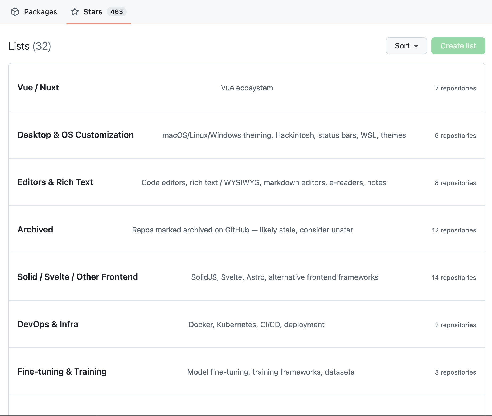

# github-manage-stars-unofficial

> Interactive CLI for organising your GitHub starred repositories into **Stars Lists**, using GitHub's unofficial UI endpoints.

```
$ ghstars
```



GitHub's "Stars Lists" feature is a UI-only thing — there is no public REST or GraphQL API for creating, deleting, or assigning repos to lists. This tool fills the gap by talking to the same endpoints your browser uses, so you can:

- Bulk-categorise hundreds (or thousands) of stars into themed lists
- Dump your full star library to JSON so you can feed it to an LLM and let the model pick categories
- Delete one, several, or all of your existing lists
- Resume mid-job after network hiccups (state is checkpointed after every action)

---

## ⚠️ Disclaimer — read before you use this

This project **uses undocumented internal endpoints** of github.com. There is no contract, no SLA, and no guarantee that any of it keeps working tomorrow.

### Risks you accept by using this tool

1. **Endpoint breakage.** GitHub can change the HTML structure, the CSRF flow, the URL paths, or the request shapes at any moment. When that happens, this tool stops working until someone updates it. There is no API version to pin against.
2. **Account flags / temporary throttling.** You're driving the UI programmatically. Aggressive jitter settings (sub-second) or huge volumes can look like abuse. We default to 1.5–3.0s jitter between requests for a reason — keep it there or higher.
3. **Cookie exposure.** This tool authenticates with your **browser session cookies** (`user_session`, `_gh_sess`). Those are equivalent to your password. They live unencrypted in `~/.config/ghstars/credentials.json` with `chmod 600` while the tool needs them, but if your filesystem is compromised, so is your GitHub account. Use the `clear-credentials` command (or the menu option) the moment you're done.
4. **Hard 32-list limit.** GitHub enforces a maximum of 32 lists per account. This tool refuses to attempt more.
5. **Stars Lists data is not in your normal backups.** Deletion is permanent — there is no undo.

### Project intent

The sole purpose of this project is to let users **organise their own GitHub stars** at a scale the official UI cannot reach. It is not a scraper, not a mass-action tool, and not designed to operate against accounts you do not own.

If GitHub asks us to take this project down, **we will**. We would much rather GitHub ship a real, supported API for Stars Lists — see [`PROPOSAL.md`](./PROPOSAL.md) for the case we'd make. Until then, this tool exists as a stopgap for people who already use the feature heavily.

---

## Install

This project uses [uv](https://docs.astral.sh/uv/) for dependency management. Either install via uv or pip — both work because the project is a standard `pyproject.toml` package.

### With uv (recommended)

```bash
git clone https://github.com/snowfluke/github-manage-stars-unofficial.git
cd github-manage-stars-unofficial
uv sync
uv run ghstars
```

Or install as a tool so `ghstars` is on your PATH globally:

```bash
uv tool install .
ghstars
```

### With pip

```bash
git clone https://github.com/snowfluke/github-manage-stars-unofficial.git
cd github-manage-stars-unofficial
pip install -e .
ghstars
```

Requires Python 3.10+.

---

## Quick start

```bash
ghstars                      # interactive menu (the easy mode)
ghstars setup                # one-time: paste your session cookies
ghstars fetch                # dump all your stars to JSON
ghstars apply --stars stars-you-202X.json   # categorise + create + assign
```

The interactive menu walks you through every step with prompts and colour-coded output. Everything below is for users who prefer flags.

---

## Recommended flow

```
┌─────────────────┐    ┌─────────────┐    ┌───────────┐    ┌─────────────┐    ┌──────────────┐
│ 1. setup        │ -> │ 2. fetch    │ -> │ 3. plan   │ -> │ 4. apply    │ -> │ 5. cleanup   │
│ (paste cookies) │    │ (dump JSON) │    │ (preview) │    │ (mutations) │    │ (clear creds)│
└─────────────────┘    └─────────────┘    └───────────┘    └─────────────┘    └──────────────┘
```

1. **Setup** — paste your `user_session` and `_gh_sess` cookies once. The tool stores them under `~/.config/ghstars/credentials.json` with mode `600`.
2. **Fetch** — `ghstars fetch` writes a clean JSON array of every starred repo (name, description, language, topics, etc.). This file is **the right thing to hand to an LLM** if you want AI-assisted categorisation.
3. **Plan** — `ghstars apply --phase plan --stars <file>` shows you the proposed bucketing without touching GitHub. Iterate on your categories until happy.
4. **Apply** — same command without `--phase plan` creates the lists and assigns repos. Progress is checkpointed; you can Ctrl-C and resume.
5. **Cleanup** — `ghstars clear-credentials`, then rotate the session at https://github.com/settings/sessions.

---

## Letting an LLM choose your categories

The categoriser is rule-based by default (32 built-in regex categories). For better fit to *your* library, dump your stars and ask a model to propose categories:

```bash
ghstars fetch --out stars.json
```

Open [`examples/ai-prompt-template.md`](./examples/ai-prompt-template.md) for a prompt you can copy. Feed it `stars.json` and paste the resulting categories into a file matching [`examples/custom-categories.json`](./examples/custom-categories.json). Then:

```bash
ghstars apply --stars stars.json --categories my-categories.json
```

The validator will refuse anything over 32 categories, any name over 32 chars, or any case-insensitive duplicate — those are GitHub's limits, not ours.

---

## Recommended settings

The defaults err on the side of being slow and polite. Change them only if you understand the trade-off.

| Setting | Default | Notes |
|---|---|---|
| `jitter_min` | `1.5s` | Minimum delay between mutating requests. Sub-second is **not advised**. |
| `jitter_max` | `3.0s` | Upper bound; together with `jitter_min` you get random delays of 1.5–3.0s. |
| `phase_pause_min` / `phase_pause_max` | `4.0–8.0s` | Pause between phases (delete-all → create-all → assign-all). |
| `retry_attempts` | `4` | Exponential-backoff retries on transient connection errors. |
| `retry_base_seconds` | `2.0` | Backoff base. Each retry waits `base^attempt + random(0,1.5)` seconds. |

A full run for ~500 stars takes 15–25 minutes with the defaults. **Don't try to make this faster** — the bottleneck is GitHub's tolerance, not your network.

Edit interactively with `ghstars settings`, or write `~/.config/ghstars/settings.json` directly.

---

## Commands

| Command | Description |
|---|---|
| `ghstars` | Open the interactive menu. |
| `ghstars setup` | Paste cookies once; stored in `~/.config/ghstars/credentials.json`. |
| `ghstars status` | Show whether credentials are set, current settings, and resume state. |
| `ghstars fetch [--out FILE] [--format json|jsonl]` | Pull all starred repos into a file. |
| `ghstars list-lists` | Print your current Stars Lists. |
| `ghstars delete-lists --all` | Delete every star list. Asks for confirmation. |
| `ghstars delete-lists --slugs a,b,c` | Delete specific lists by slug. |
| `ghstars apply --stars FILE [--categories FILE] [--wipe-existing] [--phase plan\|create\|assign\|all]` | Full pipeline. |
| `ghstars settings` | Edit jitter / retry settings. |
| `ghstars clear-credentials` | Wipe stored cookies. |

Run `ghstars <cmd> --help` for full details.

---

## File layout

Everything the tool persists lives under `~/.config/ghstars/`:

```
~/.config/ghstars/
├── credentials.json          # your cookies (chmod 600)
├── settings.json             # jitter / retries
└── accounts/
    └── <your-username>/
        └── state.json        # which lists are created, which repos assigned
```

Star dumps and your custom categories live wherever you run the tool from (typically your project / Downloads folder).

---

## Troubleshooting

| Symptom | Likely cause | Fix |
|---|---|---|
| `whoami` fails on setup verification | Wrong / expired cookies, or you copied them while logged out | Sign in again, re-copy cookies, redo `setup` |
| `Cannot have more than 32 lists` | You've already hit GitHub's account-wide cap | Delete some via `ghstars delete-lists` |
| `Name has already been taken` | Case-insensitive name collision | Rename your category — see `validators.py` |
| Repeated `RemoteDisconnected` errors | GitHub closing idle keep-alives, or transient network | The built-in retry handles it; increase `retry_attempts` if it persists |
| Want to start over | | `ghstars delete-lists --all` then re-run `apply` |

---

## How it works

For the curious, here's what's actually happening under the hood:

- **Auth:** session cookies (`user_session`, `_gh_sess`) — same as your browser
- **CSRF:** per-form `authenticity_token` scraped from the relevant HTML page before each mutation
- **Create list:** `POST /stars/{user}/lists` (multipart form)
- **Delete list:** `POST /stars/{user}/lists/{slug}` with `_method=delete` (urlencoded)
- **List membership:** `POST /{owner}/{repo}/lists` with `_method=put` and `list_ids[]` (multipart) — note this is the **full** set of memberships, not a delta
- **Fetching stars:** the documented REST endpoint `/users/{user}/starred` (this part is official)

See `src/ghstars/api.py` if you want all the details — it's commented and ~250 lines.

---

## Contributing

Bug reports and patches welcome. Reverse-engineered endpoints rot quickly — if something breaks, please open an issue with the failing request URL and the response body (sanitise cookies first).

```bash
uv sync --dev
uv run pytest
uv run ruff check .
```

The repo ships with 59 unit tests covering everything that doesn't require GitHub network access (parser, validators, categoriser, state, credentials). New rules or refactors should add corresponding tests.

## Publishing (maintainers)

PyPI releases are **automated** by [`.github/workflows/release.yml`](./.github/workflows/release.yml) — the workflow runs when you publish a GitHub Release.

Requirements (one-time):
1. Create a PyPI API token at https://pypi.org/manage/account/token/.
2. Add it as a repo secret named **`PYPI_TOKEN`** (Settings → Secrets and variables → Actions).
3. (Optional) Set workflow permissions to "Read repository contents and packages permissions" — the workflow only uses `contents: read`.

To cut a release:
1. Bump the version in `pyproject.toml` **and** `src/ghstars/__init__.py` (they must match).
2. Update `CHANGELOG.md`.
3. Commit, then tag: `git tag v0.x.y && git push --tags`.
4. On GitHub: **Releases → Draft a new release → Publish release** (using that tag).
5. The `release` workflow runs tests, builds the sdist + wheel, and publishes to PyPI.

If the tag's version doesn't match `ghstars.__version__`, the workflow fails before publishing.

### Manual fallback

```bash
uv build                 # writes dist/ghstars-*.whl and -*.tar.gz
UV_PUBLISH_TOKEN=$PYPI_TOKEN uv publish
```

---

## See also

- [`PROPOSAL.md`](./PROPOSAL.md) — what an official GitHub API for Stars Lists could look like
- [`examples/`](./examples/) — sample stars dump, custom categories, AI prompt template

---

## Licence

MIT — see [`LICENSE`](./LICENSE).
